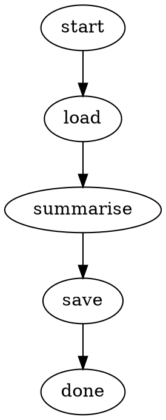
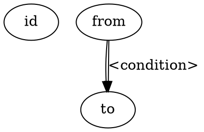

# Attractor

Attractor is a CLI tool for running **agentic pipelines** described as DOT graphs.
Each node in the graph is a typed handler — LLM calls, shell commands, file I/O,
HTTP requests, data transforms, and more. Edges carry optional conditions that
control flow. Pipelines are plain text files you can lint, diff, and version-control.



```sh
attractor run summarise.dot --var input=article.txt --var output=summary.txt
```

---

## Installation

**From source** (requires Go 1.22+):

```sh
go install github.com/ravi-parthasarathy/attractor/cmd/attractor@latest
```

**Pre-built binaries** are published on the [Releases](../../releases) page for
Linux (amd64/arm64), macOS (amd64/arm64), and Windows (amd64).

---

## Quick Start

1. **Write a pipeline** — save as `hello.dot`:

   ```dot
   digraph hello {
       start [type=start]
       greet [type=set key="msg" value="Hello, {{.name}}!"]
       show  [type=write_file path="/tmp/hello.txt" content="{{.msg}}\n"]
       done  [type=exit]
       start -> greet -> show -> done
   }
   ```

2. **Lint it**:

   ```sh
   attractor lint hello.dot
   # OK: pipeline "hello" is valid (4 nodes, 3 edges)
   ```

3. **Run it**:

   ```sh
   attractor run hello.dot --var name=World
   cat /tmp/hello.txt   # Hello, World!
   ```

4. **Inspect it**:

   ```sh
   attractor graph hello.dot
   attractor graph hello.dot --format dot   # re-emit canonical DOT
   ```

5. **Resume from checkpoint** (if a run was interrupted):

   ```sh
   attractor run pipeline.dot --checkpoint cp.json
   attractor resume pipeline.dot cp.json
   ```

---

## CLI Reference

```
attractor <command> [flags]
```

### Global flags

| Flag | Default | Description |
|------|---------|-------------|
| `--log-level` | `info` | Log level: `debug`, `info`, `warn`, `error` |
| `--log-format` | `text` | Log format: `text`, `json` |

### `attractor run <pipeline.dot>`

Execute a pipeline from the beginning.

| Flag | Default | Description |
|------|---------|-------------|
| `--var key=value` | — | Set a pipeline context variable (repeatable) |
| `--var-file path.json` | — | Load context variables from a JSON object file |
| `--model` | `anthropic:claude-sonnet-4-6` | Default LLM model (`provider:model-id`) |
| `--workdir` | `.` | Working directory for agent file operations |
| `--checkpoint` | — | Path to write/read checkpoint JSON |
| `--output-context` | — | Write final context as JSON to this file |
| `--seed` | — | Initial `seed` value in pipeline context |
| `--timeout` | `0` (none) | Max wall-clock time (e.g. `5m`, `30s`) |

### `attractor resume <pipeline.dot> <checkpoint.json>`

Resume a pipeline from a checkpoint.

Accepts the same flags as `run` except `--checkpoint` and `--seed`.

### `attractor lint <pipeline.dot>`

Validate a pipeline without running it. Checks structure and required attributes.

### `attractor graph <pipeline.dot>`

Print a human-readable summary of a pipeline.

| Flag | Default | Description |
|------|---------|-------------|
| `--format` | `text` | Output format: `text` or `dot` |

### `attractor version`

Print version and build information.

---

## Pipeline DOT Syntax

Pipelines are [Graphviz DOT](https://graphviz.org/doc/info/lang.html) digraphs.



- Every pipeline must have **exactly one** `start` node and **exactly one** `exit` node.
- All non-start nodes must be reachable from `start`.
- Attribute values are plain strings; values with spaces must be quoted.
- Attribute values can use **Go templates** rendered against the pipeline context:
  `path="{{.output_dir}}/result.txt"`.
- Edge labels are **Go template expressions** evaluated to a truthy/falsy string,
  or exact string comparisons for `switch` nodes. Omit the label for unconditional edges.

### Context templates

The pipeline context is a `map[string]string`. Templates use `{{.key}}` syntax:

```dot
set_path [type=set key="out" value="{{.base_dir}}/{{.name}}.txt"]
```

---

## Node Type Reference

### Control flow

| Type | Required attrs | Description |
|------|---------------|-------------|
| `start` | — | Entry point; exactly one per pipeline |
| `exit` | — | Normal termination; exactly one per pipeline |
| `switch` | `key` | Multi-way routing: edges matched by exact string equality against `key` value |
| `assert` | `expr` | Fail pipeline if `expr` evaluates to empty/false; optional `message` |
| `wait.human` | — | Pause and read a line from stdin; see attrs below |

**`wait.human` attrs**: `prompt`, `key` (default `<nodeID>_response`),
`options` (comma-separated; displays numbered menu and validates input).

**`switch`** routes to the edge whose label equals the context value of `key`.
An edge with label `_` or `default` is the fallback.

### LLM nodes

| Type | Required attrs | Description |
|------|---------------|-------------|
| `codergen` | — | Full LLM coding-agent loop with file/shell tools |
| `prompt` | `prompt`, `key` | Single-turn LLM call (no tools); stores response text in `key` |
| `map` | `items`, `item_key`, `prompt` | Parallel `codergen` call per element of a JSON array |

**Common LLM attrs**: `model` (override default), `system` (system prompt),
`max_tokens`.

**`codergen`** also accepts: `prompt` (template), `max_turns` (default 50).

**`map`** also accepts: `results_key`, `concurrency` (default unlimited).

### Data / context

| Type | Required attrs | Description |
|------|---------------|-------------|
| `set` | `key` | Render `value` template and store in `key` |
| `env` | `key`, `from` | Read OS environment variable `from` into `key`; optional `required`, `default` |
| `split` | `source`, `key` | Split string in context into a JSON array; `sep` (default `\n`), `trim` |
| `json_extract` | `source`, `path`, `key` | Extract a value from a JSON string by dot-path |
| `json_decode` | `source` | Unpack a JSON object into individual context keys; optional `prefix` |
| `json_pack` | `keys`, `output` | Pack comma-separated context keys into a JSON object string |
| `regex` | `source`, `pattern`, `key` | Extract a regex capture group; `group` (default 0), `no_match` |
| `string_transform` | `source`, `ops`, `key` | Apply ops chain: `trim`, `upper`, `lower`, `replace`; `old`/`new` for replace |
| `prompt` | `prompt`, `key` | (see LLM nodes) |

### I/O

| Type | Required attrs | Description |
|------|---------------|-------------|
| `read_file` | `key`, `path` | Read file contents into `key`; optional `required` |
| `write_file` | `path`, `content` | Write `content` to `path`; optional `append`, `mode` |
| `http` | `url` | HTTP request; `method`, `body`, `headers`, `timeout`, `fail_non2xx`, `response_key` |
| `exec` | `cmd` | Run shell command; `stdout_key`, `stderr_key`, `exit_code_key`, `timeout`, `fail_on_error`, `workdir` |

### Iteration

| Type | Required attrs | Description |
|------|---------------|-------------|
| `for_each` | `items`, `item_key`, `cmd` | Sequential shell-command iteration over a JSON array; `results_key`, `fail_on_error`, `timeout` |
| `map` | `items`, `item_key`, `prompt` | (see LLM nodes) |

### Parallelism

| Type | Required attrs | Description |
|------|---------------|-------------|
| `fan_out` | — | Fork to all outgoing edges in parallel |
| `fan_in` | — | Wait for all incoming branches to complete |

### Utilities

| Type | Required attrs | Description |
|------|---------------|-------------|
| `sleep` | `duration` | Pause for a duration string (e.g. `2s`, `500ms`) |
| `include` | `path` | Execute another DOT file as a sub-pipeline, sharing context |

---

## Configuration

### LLM providers

Models are selected as `provider:model-id`:

| Provider | Example |
|----------|---------|
| `anthropic` | `anthropic:claude-sonnet-4-6` |
| `openai` | `openai:gpt-4o` |
| `gemini` | `gemini:gemini-2.0-flash` |

Set via `--model` flag or per-node `model` attribute.

### Variables

Pass context variables at runtime:

```sh
# Individual variables
attractor run pipeline.dot --var output_dir=/tmp/out --var model=gpt-4o

# From a JSON file (--var overrides file values)
attractor run pipeline.dot --var-file config.json --var env=prod
```

`config.json` must be a JSON object; all values are stored as strings.

### Stylesheet

A `stylesheet` block inside the DOT file applies model settings to node groups:

```dot
digraph pipeline {
    stylesheet {
        type[codergen] { model: "anthropic:claude-opus-4-6" }
        *              { model: "anthropic:claude-haiku-4-5-20251001" }
    }
    // ... nodes and edges ...
}
```

### Logging

```sh
attractor run pipeline.dot --log-level debug --log-format json
```

---

## Examples

All examples live in [`examples/`](examples/) and pass `attractor lint`.

| File | What it demonstrates |
|------|---------------------|
| `hello_world.dot` | Minimal pipeline with a codergen node |
| `batch.dot` | `split` + `map` for parallel LLM batch processing |
| `exec_pack.dot` | `exec` + `json_pack` for shell-command pipelines |
| `for_each.dot` | Sequential iteration with `for_each` |
| `string_utils.dot` | `regex` + `string_transform` for text processing |
| `prompt_decode.dot` | `prompt` + `json_decode` for structured LLM output |
| `include/main.dot` | `include` for sub-pipeline composition |
| `switch_env.dot` | `switch` + `env` for multi-branch routing |
| `file_io.dot` | `read_file` + `write_file` + `json_extract` |
| `http_assert.dot` | `http` + `assert` for API calls with validation |
| `retry_sleep.dot` | Retry attributes + `sleep` node |

---

## Contributing

```sh
# Build
export PATH="/opt/homebrew/bin:$PATH"
go build ./...

# Test (with race detector)
go test -race ./...

# Lint
golangci-lint run ./...

# Build binary
mkdir -p bin && go build -o bin/attractor ./cmd/attractor
```

Sprint planning documents live in [`docs/sprints/`](docs/sprints/).
